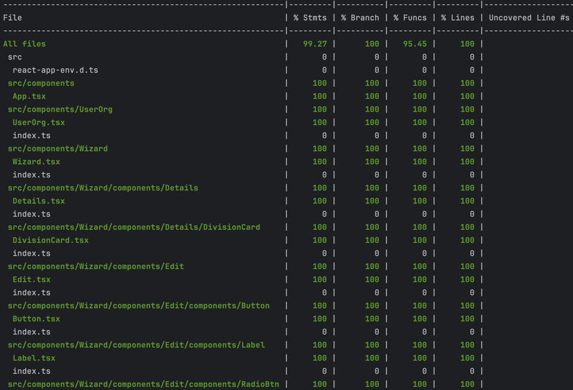

# User Org

[Live demo](https://this-is-demo-only.web.app/)

Highlights:

1. Lean stack: React, swr, typescript, css modules
2. Main architecture solution: swr + context + custom hooks 
3. Intentionally tried to avoid over-engineering, avoided redux/reducer/shared components/shared values etc, e.g.if a component is not being used in multiple components, it will be kept as a private component of is parent, instead of under a folder like ui-shared-components or ui-lib. Just so to keep this demo easier and clearer to follow. If there are things felt could be done differently, happy to discuss at next stage
4. mutate swr local cache to simulate a POST call

### Directory Layout

```shell
├── /node_modules/              # 3rd-party libraries and utilities
├── /public/                    # Public assets
│   ├── /mock/                  # mock json data for swr calls
├── /src/                       # Development work
│   ├── /assets/                # fonts
│   ├── /components/            # UI components
│   ├── /context/               # contexts being shared in the app
│   ├── /helpers/               # Project assessible assets
│   │   ├── /swr.ts             # provide a generic swr fetcher
│   │   ├── /testHelpers.ts     # mock data being used in multiple tests
│   ├── /hooks/                 # reusable custom hooks
│   │   ├── /apis/              # swr related hooks
│   │   ├── /useWizard/         # <Wizard> custom hooks
│   ├── /index.tsx              # App config
│   ├── /index.css              # App global styles
│── README.md                   # Readme file
│── package.json                # The list of project dependencies and NPM
```

## Stack

### Framework

* React.js

### 3rd Party Libs

* swr - **leaner and more responsive solution**
* lodash - **handy util functions**

### Testing

* Jest
* Testing Library

### Code Quality Control

* Eslint
* Prettier

### Installation
Clone or download this project.

```sh
$ cd user-org
$ npm install
$ npm start
```

Go to browser: localhost:3000

### Test Coverage Report
```sh
$ cd user-org
$ npm install
$ npm run coverage
```


### Todos

* eslint a11y

## License

MIT


This project was bootstrapped with [Create React App](https://github.com/facebook/create-react-app

# Getting Started with Create React App

This project was bootstrapped with [Create React App](https://github.com/facebook/create-react-app).

## Available Scripts

In the project directory, you can run:

### `npm start`

Runs the app in the development mode.\
Open [http://localhost:3000](http://localhost:3000) to view it in the browser.

The page will reload if you make edits.\
You will also see any lint errors in the console.

### `npm test`

Launches the test runner in the interactive watch mode.\
See the section about [running tests](https://facebook.github.io/create-react-app/docs/running-tests) for more information.

### `npm run build`

Builds the app for production to the `build` folder.\
It correctly bundles React in production mode and optimizes the build for the best performance.

The build is minified and the filenames include the hashes.\
Your app is ready to be deployed!

See the section about [deployment](https://facebook.github.io/create-react-app/docs/deployment) for more information.

### `npm run eject`

**Note: this is a one-way operation. Once you `eject`, you can’t go back!**

If you aren’t satisfied with the build tool and configuration choices, you can `eject` at any time. This command will remove the single build dependency from your project.

Instead, it will copy all the configuration files and the transitive dependencies (webpack, Babel, ESLint, etc) right into your project so you have full control over them. All of the commands except `eject` will still work, but they will point to the copied scripts so you can tweak them. At this point you’re on your own.

You don’t have to ever use `eject`. The curated feature set is suitable for small and middle deployments, and you shouldn’t feel obligated to use this feature. However we understand that this tool wouldn’t be useful if you couldn’t customize it when you are ready for it.

## Learn More

You can learn more in the [Create React App documentation](https://facebook.github.io/create-react-app/docs/getting-started).

To learn React, check out the [React documentation](https://reactjs.org/).
